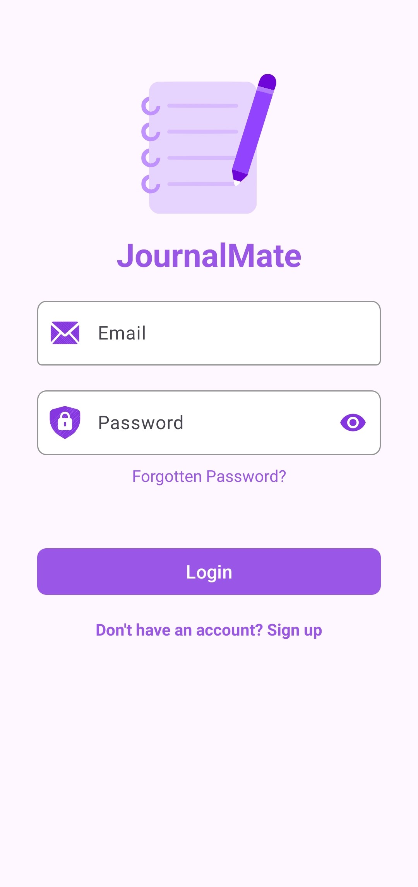
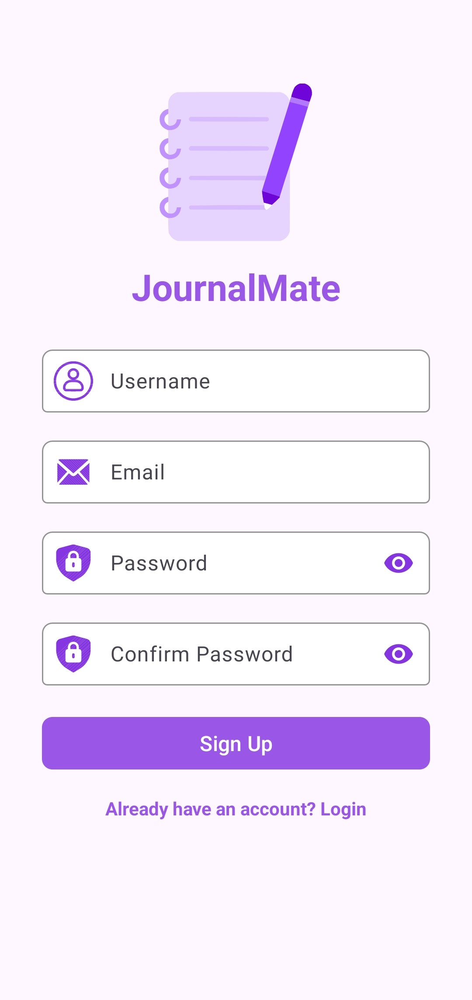
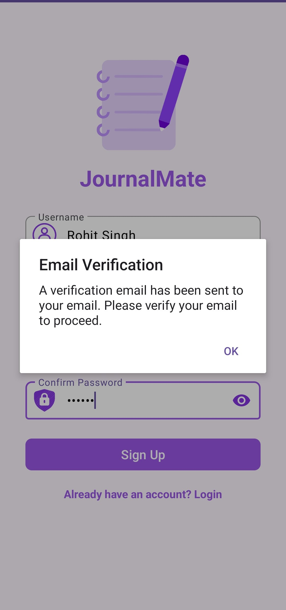
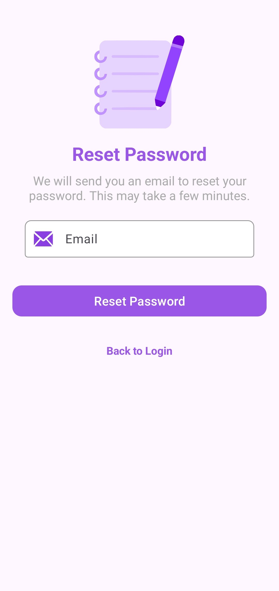

**JournalMate**  
JournalMate is a journal management app designed to help users record and organize their thoughts, activities, and daily experiences. Built with Android's modern development practices, the app provides users with features such as email verification, password verification, journal entry creation, image cropping using Ucrop, and a seamless sign-up process. Firebase Authentication, Storage, and Firestore ensure secure and reliable journal storage.

### Features
- **Email Verification:** Ensures secure email registration and login using Firebase, requiring users to verify their email addresses before accessing their accounts.
- **Password Verification:** Allows users to securely reset their passwords and verify their identity during the password recovery process.
- **Sign Up:** Users can create new accounts easily with a user-friendly sign-up process.
- **Journal Entry Management:** Add and view journal entries with ease.
- **Image Cropping:** Users can crop images for their journal entries using the Ucrop library, enhancing their visual content.
- **Firebase Storage:** Stores images securely in Firebase Storage, enabling users to attach images to their journal entries.
- **Firestore:** Utilizes Firebase Firestore to store and manage journal entries in a scalable, cloud-based database.
- **Responsive UI:** Built with Material Design principles to provide an intuitive user experience.

### Screenshots
Here are some of the key layouts of the app:

- **Main Activity:** Acts as the sign-in hub where users can log in or navigate to the sign-up screen.
  
- **Sign Up Layout:** Allows users to create new accounts and verify their email addresses through Firebase.
  
- **Add Journal Layout:** This layout allows users to create new journal entries, including fields for title, description, and date, with options to add cropped images.
  
- **Email Verification Layout:** Prompts users to verify their email addresses through Firebase.
  
  
- **Password Reset Layout:** Allows users to initiate a password reset and verify their identity.
  
- **Journal List Layout:** Displays all journal entries.
  

### Project Structure
- **Firebase:** Used for user authentication, email verification, password management, and journal storage.
- **Firebase Storage:** Used for securely storing images uploaded by users.
- **Firestore:** Stores journal entries in a scalable, cloud-based database, allowing for efficient data management and retrieval.
- **Ucrop:** Integrated for image cropping, allowing users to edit images before adding them to their journal entries.
- **Data Binding and ViewModel:** Used to bind UI components to data sources in the app.
- **Material Design:** Ensures a modern, user-friendly interface.

### Getting Started

#### Prerequisites
- Install Android Studio.
- Set up a Firebase project and add the `google-services.json` file in the app/ directory.
- Add your Firebase configuration for authentication and enable email sign-in.

#### Installation
Clone the repository:

```bash
git clone https://github.com/your-repo/JournalMate.git
```

- Open the project in Android Studio.
- Sync the Gradle files to download dependencies.
- Connect your Firebase project by adding the `google-services.json` file.

#### Running the App
- Build the project in Android Studio.
- Run the app on an emulator or Android device.

### Technologies Used
- **Kotlin:** Core programming language used.
- **Firebase Authentication:** For user management (sign-up, email verification, password reset).
- **Firebase Storage:** For storing images securely.
- **Firestore:** For managing journal entries in a scalable, cloud-based database.
- **Ucrop:** Library for image cropping to enhance journal entries.
- **Data Binding and ViewModel:** Ensures a smooth UI experience.
- **Material Design:** Provides a modern and intuitive user interface.

### Contributing
If you would like to contribute to this project:
1. Fork the repository.
2. Create a new branch for your feature (`git checkout -b feature-branch`).
3. Commit your changes (`git commit -m 'Add new feature'`).
4. Push to the branch (`git push origin feature-branch`).
5. Open a pull request.

### License
This project is licensed under the MIT License.
